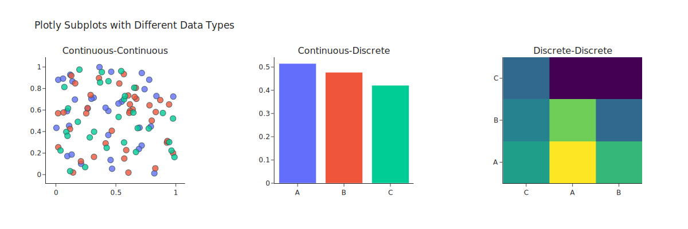
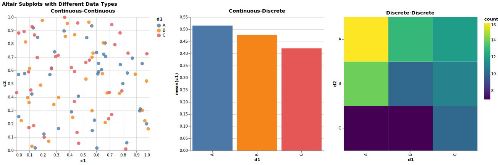
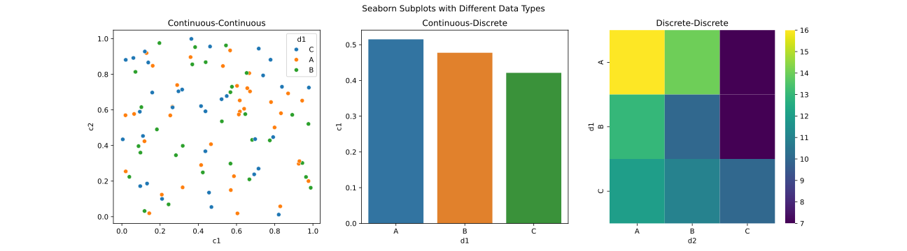
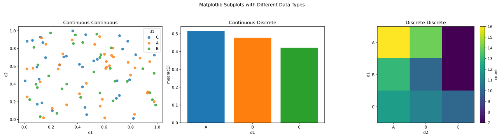

# SVG Plots
For a demo of pulling SVG charts produced with various libraries in Python and R into Adobe Illustrator.

## Plotly

## Altair

## Seaborn

## Matplotlib

## ggPlot2

## R Plotly

## Lattice

## Base R
