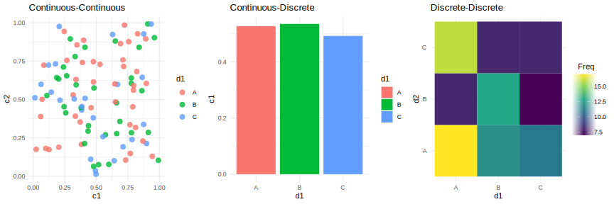
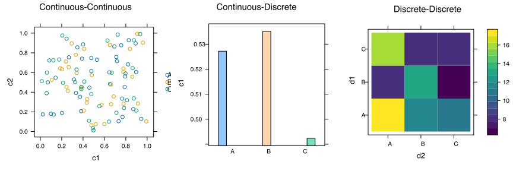
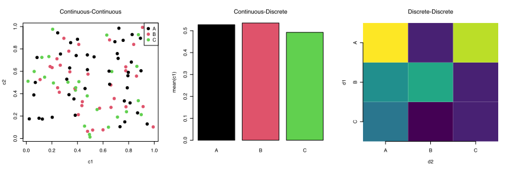

# SVG Plots
For a demo of pulling SVG charts produced with various libraries in Python and R into Adobe Illustrator.

## Getting Started
All you have to do to get these beautiful charts is clone this repo:

```bash
git clone https://github.com/janeadams/charts-to-svg.git
```

and they'll be in [plots/*.svg](plots/).

## Plotly


## Altair


## Seaborn


## Matplotlib


## ggPlot2


## R Plotly


## Lattice


## Base R
